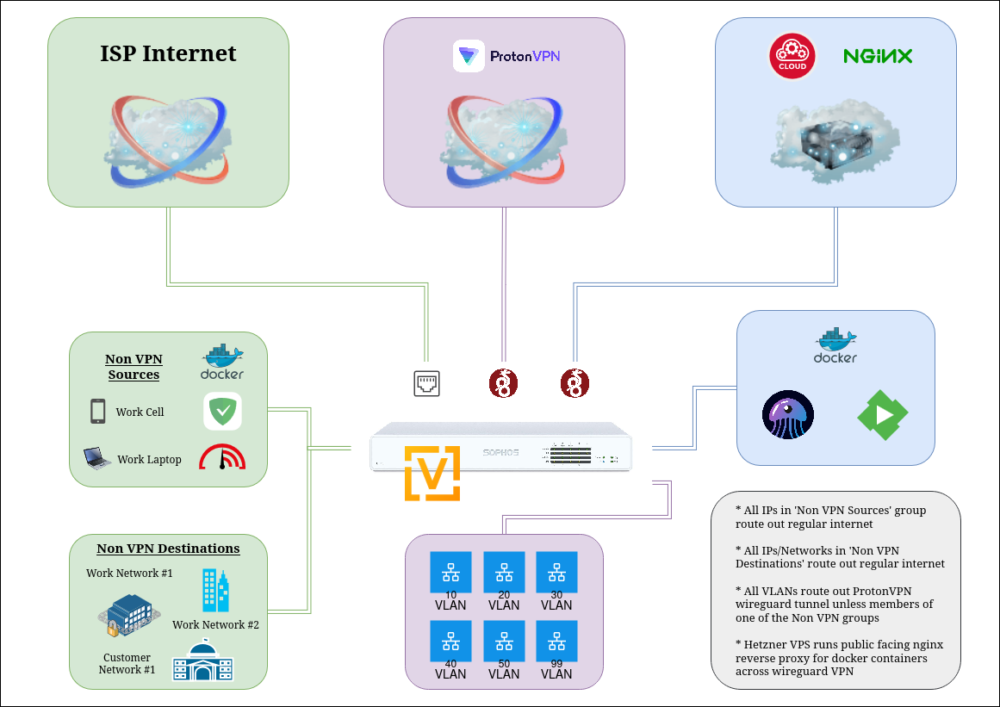

<p align="center">
  
</p>

# VyOS w/ Policy Based Routing & ProtonVPN

This repository contains a VyOS firewall configuration with a ProtonVPN WireGuard VPN using policy based routing.  All VLANs are terminated on the firewall which enforces all security policy.  Everything is fairly locked down and isolated by default.  Explicit access is defined where appropriate. 

- An address-group that specifies NONVPN-SRC addresses to egress out the regular internet connection
- A network-group that specifies NONVPN-DEST networks to egress out the regular internet connection
- All VLANs, unless included in of the NONVPN groups, egress out the ProtonVPN wireguard connection
- A blackhole VPN route preventing traffic from egressing the regular internet connection when the VPN is down
- An UNTRUSTED VLAN blocked from egressing both the regular internet connection AND the VPN
- An address-group that specifies ADMIN addresses which have full access to all networks
- Firewall rules allowing access to a local nginx reverse proxy and local DNS
- A couple DNAT rules for NAT type resolutions with Xbox and PlayStation online access
- An additional WireGuard tunnel connected to a Hetzner VPS that:
    - Provides public access to containers (Emby/Jellyseerr) on my network via a nginx reverse proxy
    - Hides my home IP and prevents punching any additional holes in firewall for public access


You can find a script to log, monitor and rotate between multiple ProtonVPN WireGuard connections [here](https://github.com/nicodemus84/vyos-protonvpn-wireguard-watchdog).

I will work on adding a project for my Hetzner VPS setup that pairs with this.

Below is a breakdown of each section.  You can view a full [config](vyos-config.boot) with example IP address and network entries. 


---


### Set the firewall global-options.

```
set firewall global-options all-ping 'enable'
set firewall global-options broadcast-ping 'disable'
set firewall global-options directed-broadcast 'enable'
set firewall global-options ip-src-route 'disable'
set firewall global-options ipv6-receive-redirects 'disable'
set firewall global-options ipv6-source-validation 'disable'
set firewall global-options ipv6-src-route 'disable'
set firewall global-options log-martians 'enable'
set firewall global-options send-redirects 'enable'
set firewall global-options source-validation 'disable'
set firewall global-options state-policy established action 'accept'
set firewall global-options state-policy invalid action 'drop'
set firewall global-options state-policy invalid log
set firewall global-options state-policy related action 'accept'
set firewall global-options syn-cookies 'enable'
set firewall global-options twa-hazards-protection 'disable'
```


### Create the ADMIN group.  These addresses will have full access to all VLANs.

```
set firewall group address-group ADMIN address '<ADMIN-IP-1>'
set firewall group address-group ADMIN address '<ADMIN-IP-2>'
set firewall group address-group ADMIN address '<ADMIN-IP-3>'
set firewall group address-group ADMIN address '<ADMIN-IP-4>'
set firewall group address-group ADMIN address '<ADMIN-IP-5>'
set firewall group address-group ADMIN description '##### FULL ACCESS ADMIN CLIENTS #####'
```


### Create the NONVPN-SRC group.  These addresses will be ones you want to egress your regular internet connection via PBR. (ie. Monitoring, location based IoT devices, speedtests)

```
set firewall group address-group NONVPN-SRC address '<NONVPN-SRC-IP-1>'
set firewall group address-group NONVPN-SRC address '<NONVPN-SRC-IP-2>'
set firewall group address-group NONVPN-SRC address '<NONVPN-SRC-IP-3>'
set firewall group address-group NONVPN-SRC address '<NONVPN-SRC-IP-4>'
set firewall group address-group NONVPN-SRC address '<NONVPN-SRC-IP-5>'
set firewall group address-group NONVPN-SRC description '##### NON VPN SOURCE ADDRESSES #####'
```


### Create the NONVPN-DEST group.  These networks will be ones you want to egress your regular internet connection via PBR. (ie. Work related networks)

```
set firewall group network-group NONVPN-DEST description '##### NON VPN DESTINATION NETWORKS #####'
set firewall group network-group NONVPN-DEST network '<WORK-NETWORK-1>'
set firewall group network-group NONVPN-DEST network '<DATACENTER-NETWORK-1>'
set firewall group network-group NONVPN-DEST network '<DATACENTER-NETWORK-2>'
set firewall group network-group NONVPN-DEST network '<CUSTOMER-NETWORK-1>'
```


### Create the RFC1918 group.  This is so that we can explicity set that these networks should never route over the VPN via PBR.

```
set firewall group network-group RFC1918 description '##### RFC1918 NETWORKS #####'
set firewall group network-group RFC1918 network '192.168.0.0/16'
set firewall group network-group RFC1918 network '172.16.0.0/12'
set firewall group network-group RFC1918 network '10.0.0.0/8'
```


## Create the top-down FORWARD chain rules.

### Create the ADMIN full access to all VLANs rule.

```
set firewall ipv4 forward filter default-action 'drop'
set firewall ipv4 forward filter default-log
set firewall ipv4 forward filter rule 10 action 'accept'
set firewall ipv4 forward filter rule 10 description '##### ALLOW ADMIN CLIENTS FULL ACCESS #####'
set firewall ipv4 forward filter rule 10 destination group network-group 'RFC1918'
set firewall ipv4 forward filter rule 10 source group address-group 'ADMIN'
```


### Create the allow local DNS access rule.

```
set firewall ipv4 forward filter rule 20 action 'accept'
set firewall ipv4 forward filter rule 20 description '##### ALLOW LOCAL DNS ACCESS #####'
set firewall ipv4 forward filter rule 20 destination address '<LOCAL-DNS-IP>'
set firewall ipv4 forward filter rule 20 destination port '53'
set firewall ipv4 forward filter rule 20 protocol 'udp'
set firewall ipv4 forward filter rule 20 source group network-group 'RFC1918'
```


### Create the rules to explicity block the UNTRUSTED VLAN from egressing out to the internet via VPN or your regular internet connection.

```
set firewall ipv4 forward filter rule 30 action 'drop'
set firewall ipv4 forward filter rule 30 description '##### BLOCK UNTRUSTED INTERNET ACCESS VIA VPN #####'
set firewall ipv4 forward filter rule 30 destination address '0.0.0.0/0'
set firewall ipv4 forward filter rule 30 outbound-interface name 'wg1'
set firewall ipv4 forward filter rule 30 source address '<UNTRUSTED-VLAN-SUBNET>'

set firewall ipv4 forward filter rule 31 action 'drop'
set firewall ipv4 forward filter rule 31 description '##### BLOCK UNTRUSTED INTERNET ACCESS VIA WAN #####'
set firewall ipv4 forward filter rule 31 destination address '0.0.0.0/0'
set firewall ipv4 forward filter rule 31 outbound-interface name 'eth1'
set firewall ipv4 forward filter rule 31 source address '<UNTRUSTED-VLAN-SUBNET>'
```


### Create the rules to allow all traffic to egress out both your regular internet connection and the VPN.  PBR will handle which one is used.

```
set firewall ipv4 forward filter rule 40 action 'accept'
set firewall ipv4 forward filter rule 40 description '##### ALLOW INTERNET ACCESS VIA VPN #####'
set firewall ipv4 forward filter rule 40 destination address '0.0.0.0/0'
set firewall ipv4 forward filter rule 40 outbound-interface name 'wg1'
set firewall ipv4 forward filter rule 40 source group network-group 'RFC1918'

set firewall ipv4 forward filter rule 41 action 'accept'
set firewall ipv4 forward filter rule 41 description '##### ALLOW INTERNET ACCESS VIA WAN #####'
set firewall ipv4 forward filter rule 41 destination address '0.0.0.0/0'
set firewall ipv4 forward filter rule 41 outbound-interface name 'eth1'
set firewall ipv4 forward filter rule 41 source group network-group 'RFC1918'
```


### Create the rules to allow local access to local nginx reverse proxy and Emby server.

```
set firewall ipv4 forward filter rule 50 action 'accept'
set firewall ipv4 forward filter rule 50 description '##### ALLOW LOCAL REVERSE PROXY ACCESS #####'
set firewall ipv4 forward filter rule 50 destination address '<LOCAL-REVERSE-PROXY-IP>'
set firewall ipv4 forward filter rule 50 destination port '443'
set firewall ipv4 forward filter rule 50 protocol 'tcp'
set firewall ipv4 forward filter rule 50 source group network-group 'RFC1918'

set firewall ipv4 forward filter rule 51 action 'accept'
set firewall ipv4 forward filter rule 51 description '##### ALLOW LOCAL ACCESS TO EMBY #####'
set firewall ipv4 forward filter rule 51 destination address '<EMBY-IP>'
set firewall ipv4 forward filter rule 51 destination port '8096'
set firewall ipv4 forward filter rule 51 protocol 'tcp'
set firewall ipv4 forward filter rule 51 source group network-group 'RFC1918'
```


### Create the rules to allow public access to Emby and Jellyseerr containers via public facing nginx reverse proxy on Hetzner VPS via WireGuard VPN.

```
set firewall ipv4 forward filter rule 60 action 'accept'
set firewall ipv4 forward filter rule 60 description '##### ALLOW CLOUD REVERSE PROXY OVER WIREGUARD TO EMBY #####'
set firewall ipv4 forward filter rule 60 destination address '<EMBY-IP>'
set firewall ipv4 forward filter rule 60 destination port '8096'
set firewall ipv4 forward filter rule 60 protocol 'tcp'
set firewall ipv4 forward filter rule 60 source address '<HETZNER-PEER-WIREGUARD-IP>'

set firewall ipv4 forward filter rule 61 action 'accept'
set firewall ipv4 forward filter rule 61 description '##### ALLOW CLOUD REVERSE PROXY OVER WIREGUARD TO JELLYSEERR #####'
set firewall ipv4 forward filter rule 61 destination address '<JELLYSEERR-IP>'
set firewall ipv4 forward filter rule 61 destination port '5055'
set firewall ipv4 forward filter rule 61 protocol 'tcp'
set firewall ipv4 forward filter rule 61 source address '<HETZNER-PEER-WIREGUARD-IP>'
```


### Create the rules to isolate all VLANs.

```
set firewall ipv4 forward filter rule 110 action 'accept'
set firewall ipv4 forward filter rule 110 description '##### ISOLATE VLAN 10 - LAN NETWORK #####'
set firewall ipv4 forward filter rule 110 destination address '<VLAN-10-SUBNET>'
set firewall ipv4 forward filter rule 110 source address '<VLAN-10-SUBNET>'

set firewall ipv4 forward filter rule 120 action 'accept'
set firewall ipv4 forward filter rule 120 description '##### ISOLATE VLAN 20 - WIFI NETWORK #####'
set firewall ipv4 forward filter rule 120 destination address '<VLAN-20-SUBNET>'
set firewall ipv4 forward filter rule 120 source address '<VLAN-20-SUBNET>'

set firewall ipv4 forward filter rule 130 action 'accept'
set firewall ipv4 forward filter rule 130 description '##### ISOLATE VLAN 30 - UNTRUSTED NETWORK #####'
set firewall ipv4 forward filter rule 130 destination address '<VLAN-30-SUBNET>'
set firewall ipv4 forward filter rule 130 source address '<VLAN-30-SUBNET>'

set firewall ipv4 forward filter rule 180 action 'accept'
set firewall ipv4 forward filter rule 180 description '##### ISOLATE VLAN 80 - MANAGEMENT NETWORK #####'
set firewall ipv4 forward filter rule 180 destination address '<VLAN-80-SUBNET>'
set firewall ipv4 forward filter rule 180 source address '<VLAN-80-SUBNET>'

set firewall ipv4 forward filter rule 188 action 'accept'
set firewall ipv4 forward filter rule 188 description '##### ISOLATE VLAN 88 - WIREGUARD NETWORK #####'
set firewall ipv4 forward filter rule 188 destination address '<VLAN-88-SUBNET>'
set firewall ipv4 forward filter rule 188 source address '<VLAN-88-SUBNET>'
```


### Create the firewall rules for Xbox and PlayStation online access.

```
set firewall ipv4 forward filter rule 300 action 'accept'
set firewall ipv4 forward filter rule 300 description '##### ACCEPT XBOX LIVE #####'
set firewall ipv4 forward filter rule 300 destination address '<XBOX-IP>'
set firewall ipv4 forward filter rule 300 destination port '50029'
set firewall ipv4 forward filter rule 300 log
set firewall ipv4 forward filter rule 300 protocol 'tcp_udp'

set firewall ipv4 forward filter rule 301 action 'accept'
set firewall ipv4 forward filter rule 301 description '##### ALLOW PLAYSTATION PLUS TCP #####'
set firewall ipv4 forward filter rule 301 destination address '<PLAYSTATION-IP>'
set firewall ipv4 forward filter rule 301 destination port '3478-3480'
set firewall ipv4 forward filter rule 301 log
set firewall ipv4 forward filter rule 301 protocol 'tcp'

set firewall ipv4 forward filter rule 302 action 'accept'
set firewall ipv4 forward filter rule 302 description '##### ALLOW PLAYSTATION PLUS UDP #####'
set firewall ipv4 forward filter rule 302 destination address '<PLAYSTATION-IP>'
set firewall ipv4 forward filter rule 302 destination port '3478-3479'
set firewall ipv4 forward filter rule 302 log
set firewall ipv4 forward filter rule 302 protocol 'udp'
```


## Create the top-down INPUT chain rules.

### Create the ADMIN full access to VyOS rule.

```
set firewall ipv4 input filter default-action 'drop'
set firewall ipv4 input filter default-log
set firewall ipv4 input filter rule 10 action 'accept'
set firewall ipv4 input filter rule 10 description '##### ALLOW ADMIN CLIENTS LOCAL ACCESS #####'
set firewall ipv4 input filter rule 10 source group address-group 'ADMIN'
```


### Create the rules to isolate all VLANs to only be able to access their own gateway. (ie. DHCP, ICMP)

```
set firewall ipv4 input filter rule 110 action 'accept'
set firewall ipv4 input filter rule 110 description '##### ALLOW VLAN 10 - LAN LOCAL ACCESS #####'
set firewall ipv4 input filter rule 110 destination address '<VLAN-10-GATEWAY>'
set firewall ipv4 input filter rule 110 source address '<VLAN-10-SUBNET>'

set firewall ipv4 input filter rule 120 action 'accept'
set firewall ipv4 input filter rule 120 description '##### ALLOW VLAN 20 - WIFI LOCAL ACCESS #####'
set firewall ipv4 input filter rule 120 destination address '<VLAN-20-GATEWAY>'
set firewall ipv4 input filter rule 120 source address '<VLAN-20-SUBNET>'

set firewall ipv4 input filter rule 130 action 'accept'
set firewall ipv4 input filter rule 130 description '##### ALLOW VLAN 30 - UNTRUSTED LOCAL ACCESS #####'
set firewall ipv4 input filter rule 130 destination address '<VLAN-30-GATEWAY>'
set firewall ipv4 input filter rule 130 source address '<VLAN-30-SUBNET>'

set firewall ipv4 input filter rule 180 action 'accept'
set firewall ipv4 input filter rule 180 description '##### ALLOW VLAN 80 - MANAGEMENT LOCAL ACCESS #####'
set firewall ipv4 input filter rule 180 destination address '<VLAN-80-GATEWAY>'
set firewall ipv4 input filter rule 180 source address '<VLAN-80-SUBNET>'

set firewall ipv4 input filter rule 188 action 'accept'
set firewall ipv4 input filter rule 188 description '##### ALLOW VLAN 88 - WIREGUARD LOCAL ACCESS #####'
set firewall ipv4 input filter rule 188 destination address '<VLAN-88-GATEWAY>'
set firewall ipv4 input filter rule 188 source address '<VLAN-88-SUBNET>'
```


## Setup the interfaces

### Create the LAN interface, VLAN interfaces, and set the offload parameters.  I used a LACP bond to my switch.

```
set interfaces bonding bond0 member interface 'eth0'
set interfaces bonding bond0 member interface 'eth4'
set interfaces bonding bond0 vif 10 address '<VLAN-10-GATEWAY>'
set interfaces bonding bond0 vif 10 description 'VLAN10 - LAN'
set interfaces bonding bond0 vif 20 address '<VLAN-20-GATEWAY>'
set interfaces bonding bond0 vif 20 description 'VLAN20 - WIFI'
set interfaces bonding bond0 vif 30 address '<VLAN-30-GATEWAY>'
set interfaces bonding bond0 vif 30 description 'VLAN30 - UNTRUSTED
set interfaces bonding bond0 vif 80 address '<VLAN-80-GATEWAY>'
set interfaces bonding bond0 vif 80 description 'VLAN80 - MANAGEMENT'

set interfaces ethernet eth0 offload gro
set interfaces ethernet eth0 offload gso
set interfaces ethernet eth0 offload lro
set interfaces ethernet eth0 offload rfs
set interfaces ethernet eth0 offload rps
set interfaces ethernet eth0 offload sg
set interfaces ethernet eth0 offload tso

set interfaces ethernet eth4 offload gro
set interfaces ethernet eth4 offload gso
set interfaces ethernet eth4 offload rfs
set interfaces ethernet eth4 offload rps
set interfaces ethernet eth4 offload sg
set interfaces ethernet eth4 offload tso
```


### Create the WAN interface, set the static IP (or DHCP), and set the offload parameters.

```
set interfaces ethernet eth1 address '<WAN-STATIC-IP>'
set interfaces ethernet eth1 description 'WAN'
set interfaces ethernet eth1 offload rfs
set interfaces ethernet eth1 offload rps
set interfaces ethernet eth1 offload sg
```


### Create the WireGuard tunnel to the Hetzner VPS.

### You can use 'sudo wg-show' in VyOS to view your WireGuard tunnel status.

```
set interfaces wireguard wg0 address '<HETZNER-LOCAL-WIREGUARD-IP>'
set interfaces wireguard wg0 description 'PUBLIC REVERSE PROXY'
set interfaces wireguard wg0 peer HETZNER address '<HETZNER-PEER-PUBLIC-IP>'
set interfaces wireguard wg0 peer HETZNER allowed-ips '<HETZNER-PEER-WIREGUARD-IP>'
set interfaces wireguard wg0 peer HETZNER persistent-keepalive '20'
set interfaces wireguard wg0 peer HETZNER port '51820'
set interfaces wireguard wg0 peer HETZNER preshared-key '<HETZNER-PSK>'
set interfaces wireguard wg0 peer HETZNER public-key '<HETZNER-PUBKEY>'
set interfaces wireguard wg0 private-key '<HETZNER-PRIVKEY>'
```


### Create the WireGuard tunnel to ProtonVPN.  With ProtonVPN, you will have to use 10.2.0.2/32 as your local address.

### You can use 'sudo wg-show' in VyOS to view your WireGuard tunnel status.

```
set interfaces wireguard wg1 address '10.2.0.2/32'
set interfaces wireguard wg1 description 'PROTONVPN'
set interfaces wireguard wg1 peer <PEER-NAME> address '<PROTONVPN-PEER-PUBLIC-IP>'
set interfaces wireguard wg1 peer <PEER-NAME> allowed-ips '0.0.0.0/0'
set interfaces wireguard wg1 peer <PEER-NAME> persistent-keepalive '20'
set interfaces wireguard wg1 peer <PEER-NAME> port '51820'
set interfaces wireguard wg1 peer <PEER-NAME> public-key '<PROTONVPN-PUBKEY>'
set interfaces wireguard wg1 private-key '<PROTONVPN-PRIVKEY>'
```


## Create NAT Rules

### Create the DNAT rules for Xbox and PlayStation online access.

```
set nat destination rule 100 description 'XBox Live'
set nat destination rule 100 destination port '50029'
set nat destination rule 100 inbound-interface name 'eth1'
set nat destination rule 100 protocol 'tcp_udp'
set nat destination rule 100 translation address '<XBOX-IP>'

set nat destination rule 101 description 'PlayStation Plus TCP'
set nat destination rule 101 destination port '3478-3480'
set nat destination rule 101 inbound-interface name 'eth1'
set nat destination rule 101 protocol 'tcp'
set nat destination rule 101 translation address '<PLAYSTATION-IP>'

set nat destination rule 102 description 'PlayStation Plus UDP'
set nat destination rule 102 destination port '3478-3479'
set nat destination rule 102 inbound-interface name 'eth1'
set nat destination rule 102 protocol 'udp'
set nat destination rule 102 translation address '<PLAYSTATION-IP>'
```


### Create the SNAT rules for both the VPN and your regular internet connection.

```
set nat source rule 100 log
set nat source rule 100 outbound-interface name 'eth1'
set nat source rule 100 translation address 'masquerade'

set nat source rule 101 log
set nat source rule 101 outbound-interface name 'wg1'
set nat source rule 101 translation address 'masquerade'
```


## Setup Policy Based Routing (PBR), static routes, and blackhole route.

### Set all VLAN interfaces that you want included as part of PBR.

```
set policy route VPN interface 'bond0.10'
set policy route VPN interface 'bond0.20'
set policy route VPN interface 'bond0.30'
set policy route VPN interface 'bond0.80'
```


### Create the top-down PBR rules.

### Local traffic, and the NONVPN groups egress your regular internet connection.  Everything else egresses ProtonVPN.

```
set policy route VPN rule 10 destination group network-group 'RFC1918'
set policy route VPN rule 10 set table 'main'

set policy route VPN rule 20 set table 'main'
set policy route VPN rule 20 source group address-group 'NONVPN-SRC'

set policy route VPN rule 30 destination group network-group 'NONVPN-DEST'
set policy route VPN rule 30 set table 'main'

set policy route VPN rule 100 destination address '0.0.0.0/0'
set policy route VPN rule 100 set table '100'
set policy route VPN rule 100 source group network-group 'RFC1918'
```


### Create the static routes for your regular internet connection and ProtonVPN.  

### I also created a blackhole route for ProtonVPN.
### This makes it so that traffic destined for ProtonVPN will never leak into the main route table if it is down.

```
set protocols static route 0.0.0.0/0 next-hop <WAN-GATEWAY>
set protocols static table 100 route 0.0.0.0/0 blackhole distance '254'
set protocols static table 100 route 0.0.0.0/0 interface wg1 distance '1'
```


## Set other basic system parameters

```
set service lldp interface all
set service lldp legacy-protocols cdp
set service lldp management-address '<LOCAL-MGMT-IP>'

set service ntp server 0.us.pool.ntp.org
set service ntp server 1.us.pool.ntp.org

set service ssh listen-address '<LOCAL-MGMT-IP>'
set service ssh port '<SSH-PORT>'

set system config-management commit-revisions '100'

set system console device ttyS0 speed '115200'

set system host-name 'vyos'

set system ipv6 disable-forwarding

set system login banner post-login '\n<POST-LOGIN-MESSAGE>\n'
set system login banner pre-login '\n<PRE-LOGIN-MESSAGE>\n'

set system login user vyos authentication public-keys YK5NFC-GREEN key '<PUBLIC-KEY>'
set system login user vyos authentication public-keys YK5NFC-GREEN type 'sk-ssh-ed25519@openssh.com'
set system login user vyos authentication public-keys YK5NFC-RED key '<PUBLIC-KEY>'
set system login user vyos authentication public-keys YK5NFC-RED type 'sk-ssh-ed25519@openssh.com'
set system login user vyos authentication public-keys WORKSTATION key '<PUBLIC-KEY>'
set system login user vyos authentication public-keys WORKSTATION type 'ssh-ed25519'

set system name-server '9.9.9.9'
set system name-server '149.112.112.112'

set system option performance 'network-throughput'
set system option performance 'network-latency'

set system option time-format '24-hour'

set system syslog local facility all level 'info'
set system syslog local facility local7 level 'debug'

set system time-zone 'America/Chicago'

set system update-check auto-check
set system update-check url 'https://raw.githubusercontent.com/vyos/vyos-rolling-nightly-builds/main/version.json'
```


